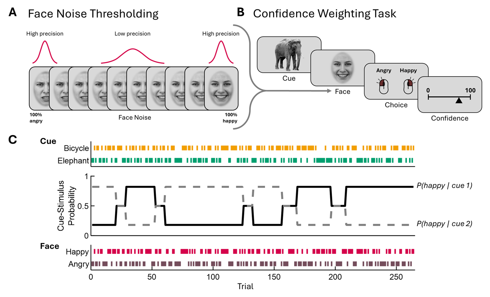

# Experimental Design: Face Emotion Recognition with Predictive Cues

## Overview

This document describes the experimental design for the CWT fMRI study investigating predictive processing in face emotion recognition. The task involves learning associations between predictive cues and emotional faces, with confidence ratings and dynamic probability changes.

*Figure: Experimental design showing face noise thresholding (A), trial sequence (B), and trial-by-trial stimulus presentation (C).*

## Task Structure

### A. Face Noise Thresholding

The facial stimuli are generated with varying levels of emotional clarity ("Face Noise"):

- **Stimulus Continuum**: Grayscale female faces ranging from "100% angry" to "100% happy"
- **Precision Levels**:
  - **High precision**: Narrow, tall Gaussian distributions at the extremes (100% angry/happy)
  - **Low precision**: Wider, shorter Gaussian distribution in the middle (ambiguous faces)
- **Noise Manipulation**: Stimuli closer to neutral emotions have higher variability in emotional content

### B. Trial Sequence

Each trial follows this sequence:

1. **Cue Presentation**: 
   - Visual cue (e.g., elephant, bicycle) presented
   - Cues are predictive of upcoming face emotion

2. **Face Stimulus**:
   - Female face with varying emotional clarity
   - Emotion follows probabilistic relationship with cue

3. **Choice Response**:
   - Participants choose between "Angry" and "Happy"
   - Mouse-based response interface

4. **Confidence Rating**:
   - Slider scale from 0 to 100
   - Participants rate confidence in their choice

### C. Trial-by-Trial Design

The experiment consists of 250 trials with dynamic probability changes:

#### Cue Types
- **Cue 1 (Elephant)**: Marked by green vertical bars
- **Cue 2 (Bicycle)**: Marked by orange vertical bars

#### Probability Structure
- **P(happy | cue 1)**: Solid black line showing probability of happy face given elephant cue
- **P(happy | cue 2)**: Dashed grey line showing probability of happy face given bicycle cue
- **Dynamic Changes**: Probabilities alternate between high (0.8) and low (0.2) in blocks
- **Inverse Relationship**: When one cue predicts happy, the other predicts angry

#### Face Presentation
- **Happy faces**: Red vertical bars
- **Angry faces**: Dark red/brown vertical bars
- **Probabilistic**: Actual face emotion follows the cue-stimulus probability structure

## Key Experimental Manipulations

### 1. Stimulus Noise
- **High noise**: Ambiguous faces with low emotional clarity
- **Low noise**: Clear faces with high emotional clarity
- **Manipulation**: Affects task difficulty and confidence calibration

### 2. Cue Validity
- **Valid trials**: Cue correctly predicts face emotion
- **Invalid trials**: Cue incorrectly predicts face emotion
- **Non-predictive trials**: Cue has no predictive relationship

### 3. Probability Reversals
- **Learning blocks**: Participants learn cue-face associations
- **Reversal blocks**: Associations change, requiring adaptation
- **TrialsSinceRev**: Number of trials since last reversal

## Behavioral Measures

### Primary Outcomes
1. **Accuracy**: Binary correct/incorrect responses
2. **Response Time**: Time to make emotion choice
3. **Confidence**: Self-reported confidence rating (0-100)

### Derived Measures
1. **Learning Rate**: Adaptation to probability changes
2. **Confidence Calibration**: Relationship between accuracy and confidence
3. **Choice Bias**: Preference for angry vs. happy responses

## Data Structure

The experimental design generates data with these key variables:

- **SubNo**: Subject identifier
- **TrialNo**: Trial number (1-250)
- **CueImg**: Cue type (0/1 for elephant/bicycle)
- **FaceEmot**: Actual face emotion (0=Angry, 1=Happy)
- **FaceResponse**: Participant's choice (0=Angry, 1=Happy)
- **Accuracy**: Binary accuracy (0=miss, 1=hit)
- **ResponseRT**: Response time in seconds
- **RawConfidence**: Confidence rating (0-100)
- **TrialValidity**: Whether cue correctly predicted face
- **StimNoise**: Noise level in face stimulus
- **TrialsSinceRev**: Trials since last probability reversal

## Research Questions

This design addresses:

1. **Predictive Processing**: How do participants learn cue-face associations?
2. **Adaptation**: How do participants adapt to changing contingencies?
3. **Confidence Calibration**: How does stimulus noise affect confidence?
4. **Learning Dynamics**: How does learning rate change over time?
5. **Individual Differences**: How do participants vary in learning strategies?

## Task Relevance

The design is particularly suitable for studying:
- **Reinforcement learning** in uncertain environments
- **Predictive processing** in emotion recognition
- **Confidence calibration** with varying stimulus clarity
- **Adaptive behavior** in changing environments 